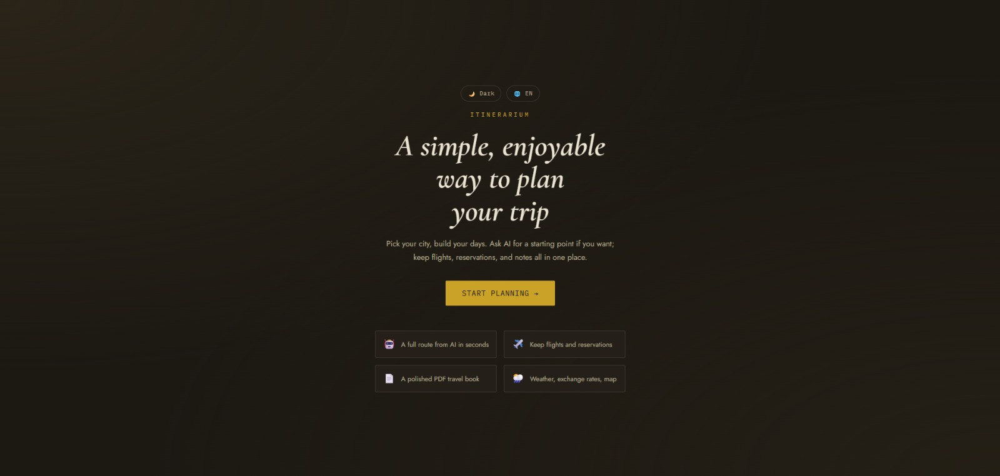
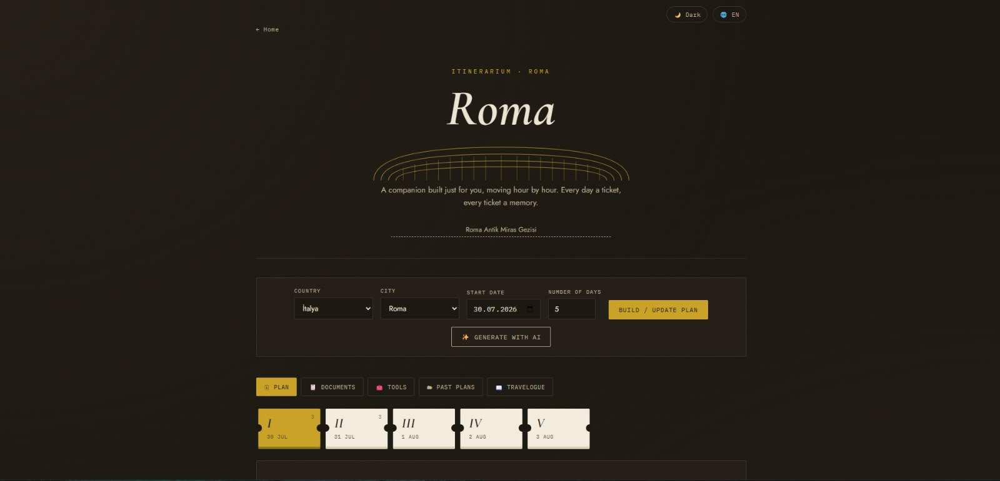
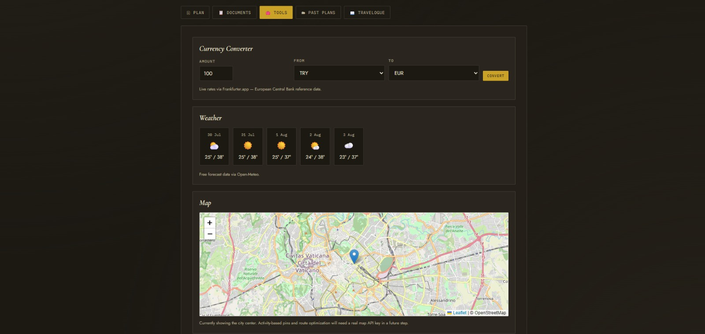
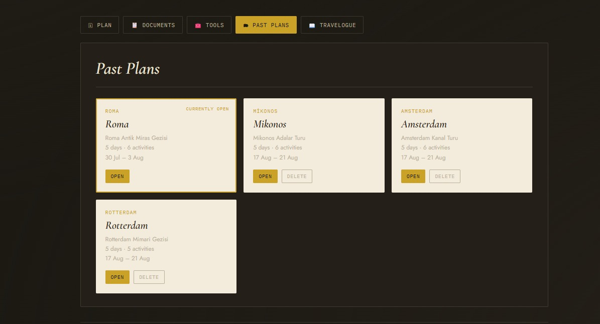
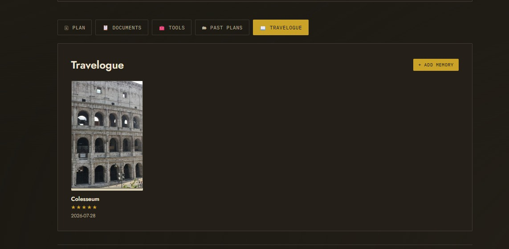

<div align="center">


# 🏛️ Itinerarium

### AI-Powered Premium Travel Planner

**Plan smarter. Travel better.**

A modern travel planning application for **Web** and **Android**, designed to help travelers create personalized itineraries, organize trips, explore destinations, and access essential travel tools through a clean and elegant interface.


</div>

---

# 📖 About

**Itinerarium** is a travel planning application that helps users organize trips quickly and efficiently.

The application enables users to generate day-by-day itineraries, explore destinations on an interactive map, manage previous travel plans, and access useful travel tools such as weather forecasts and currency conversion.

Built with modern web technologies and powered by **Capacitor**, Itinerarium is available as both a responsive web application and a native Android application.

---

# ✨ Features

### 🗓 Smart Trip Planner

- Create personalized travel itineraries
- Automatic day-by-day schedule generation
- Organize activities for every travel day

### 🗺 Interactive Maps

- Explore destinations with interactive maps
- Locate attractions visually
- Better trip planning experience

### 🛠 Travel Tools

- Weather forecast
- Currency converter
- Travel document organizer

### 📚 Travel Management

- View previous travel plans
- Manage trip history
- Easy itinerary organization

### 📱 Cross Platform

- Responsive Web Application
- Native Android Application using Capacitor

### 🎨 Modern User Interface

- Roman-inspired branding
- Clean and responsive design
- Mobile-first experience
- Lightweight and fast

---

# 📸 Application Preview

## 🏠 Home

<p align="center">

</p>

---

## 🗓 Trip Planner

<p align="center">

</p>

---

## 🛠 Travel Tools

<p align="center">

</p>

---

## 📚 Past Plans

<p align="center">

</p>

---

## 📖 Travelogue

<p align="center">

</p>

---

# 🛠 Tech Stack

### Frontend

- HTML5
- CSS3
- JavaScript (ES6)

### Mobile

- Capacitor
- Android Studio

### Libraries

- Leaflet.js

### Version Control

- Git
- GitHub

---

# 🚀 Installation

Clone the repository

```bash
git clone https://github.com/lazypanic999/Itinerarium.git
```

Move into the project directory

```bash
cd Itinerarium
```

Install dependencies

```bash
npm install
```

Sync Capacitor

```bash
npx cap sync
```

Open Android Studio

```bash
npx cap open android
```

---

# 📱 Build Android APK

Copy the latest web assets

```bash
npx cap copy android
```

Generate a Debug APK

```bash
cd android

./gradlew assembleDebug
```

APK output:

```text
android/app/build/outputs/apk/debug/app-debug.apk
```

---

# 💡 Development Objectives

This project was developed to strengthen my skills in:

- Frontend Development
- Mobile Application Development
- Responsive Web Design
- UI/UX Design
- Android Deployment with Capacitor
- Git & GitHub

Itinerarium demonstrates the development of a complete travel planning application with a focus on usability, responsive design, and cross-platform deployment.

---

# 👨‍💻 Author

**Doğukan Sağlık**

Computer Engineering Student  
Ostim Technical University

### GitHub

https://github.com/lazypanic999

### LinkedIn

https://www.linkedin.com/in/do%C4%9Fukan-sa%C4%9Fl%C4%B1k-4515a5288/

---

<div align="center">

### ⭐ If you found this project interesting, consider giving it a Star!

Made with ❤️ by **Doğukan Sağlık**

</div>